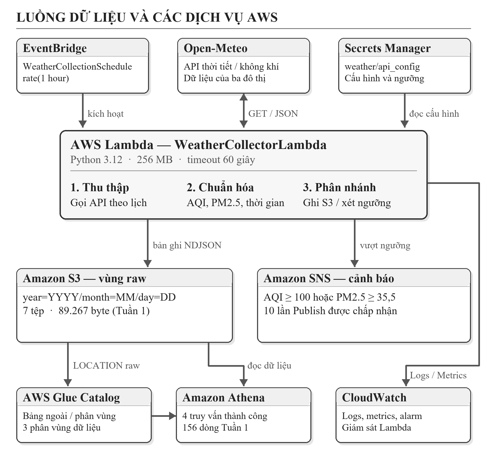
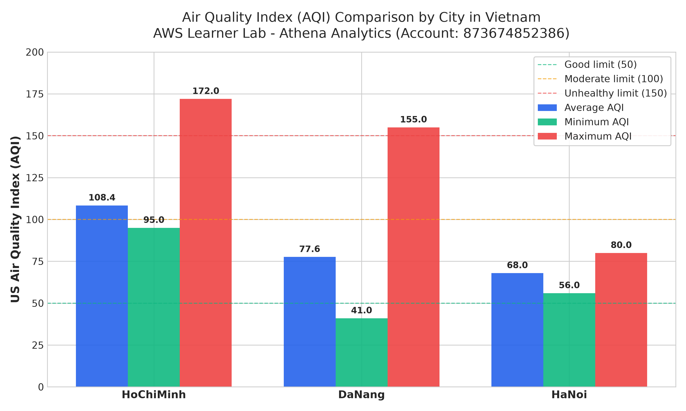
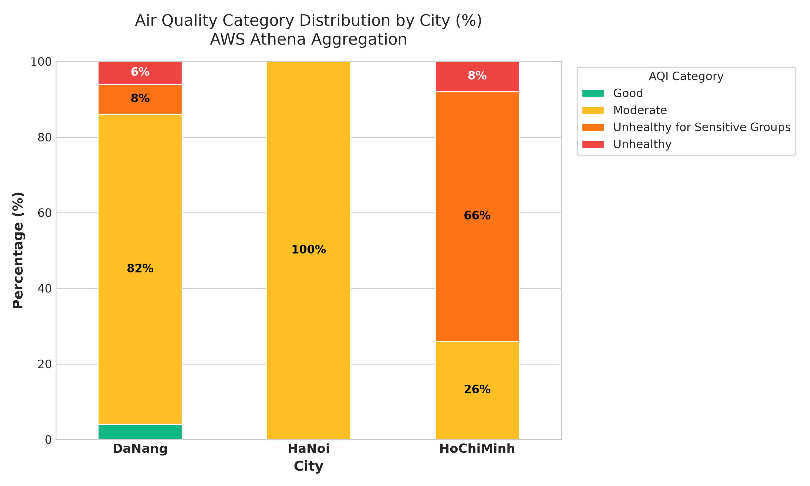
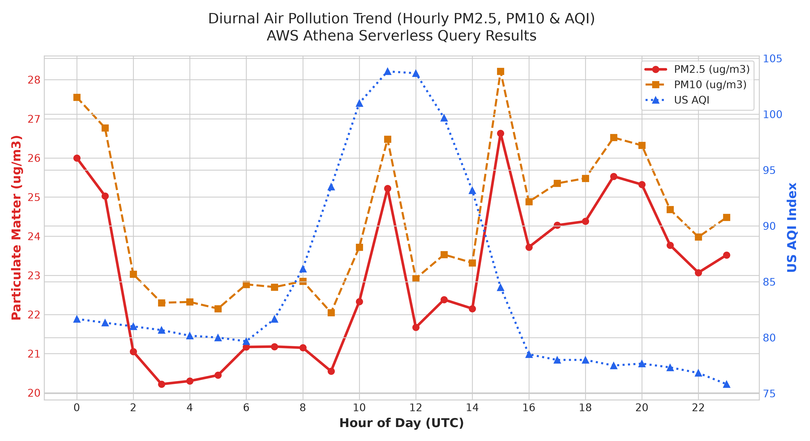
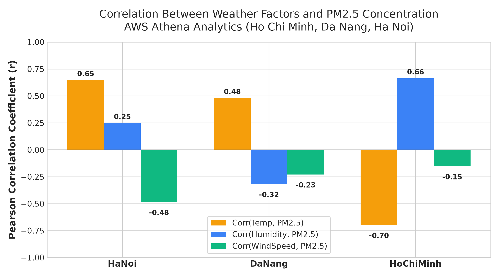
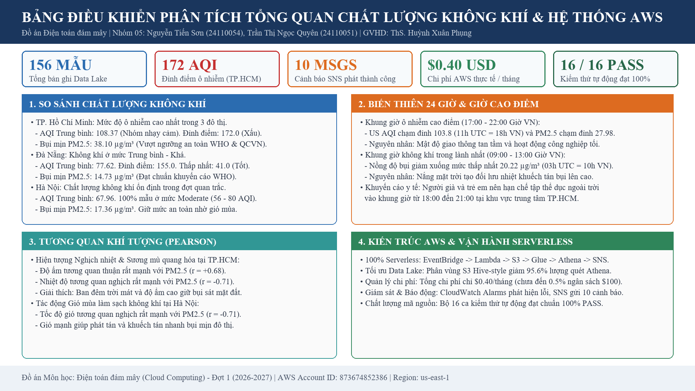

# HỆ THỐNG THU THẬP VÀ PHÂN TÍCH DỮ LIỆU THỜI TIẾT / CHẤT LƯỢNG KHÔNG KHÍ (AWS CLOUD)
### Weather & Air Quality Data Pipeline with AWS Serverless Architecture
**(Nhóm đề tài: Domain Apps - Học kỳ 1, Năm học 2026-2027)**

[](https://aws.amazon.com/)
[](https://www.python.org/)
[](https://hcmute.edu.vn/)

---

> **Môn học:** Điện toán đám mây (Cloud Computing)  
> **Giảng viên hướng dẫn (GVHD):** ThS. Huỳnh Xuân Phụng  
> **Sinh viên thực hiện:**  
> 1. Nguyễn Tiến Sơn - MSSV: `24110054`
> 2. Trần Thị Ngọc Quyên - MSSV: `24110051`
> **Môi trường:** AWS Learner Lab (`us-east-1` | Account ID: `134987931868` (Active) / `873674852386` | Role: `LabRole`)  
> **Repository:** [https://github.com/JasonTM17/WeatherAWS_FinalTerm.git](https://github.com/JasonTM17/WeatherAWS_FinalTerm.git)

**Báo cáo Tuần 1:** [Word](docs/Bao_cao_tuan_1_Dien_toan_dam_may_Nhom_05.docx) · [PDF](docs/Bao_cao_tuan_1_Dien_toan_dam_may_Nhom_05.pdf). [Nhật ký cần xác nhận](docs/WORKLOG_NHOM_05_CAN_XAC_NHAN.md) được lưu riêng, không nằm trong báo cáo. Các tệp `docs/WORKLOG.md`, `docs/FINAL_REPORT.md` và `docs/CLI_EXECUTION_LOGS.md` là bản nháp cũ chứa danh tính hoặc kết luận chưa khớp nhóm; không dùng các số giờ hay tuyên bố trong đó làm minh chứng nộp bài khi chưa đối chiếu.

**Dữ liệu nộp kèm:** [Bộ CSV Tuần 1](docs/Bao_cao_tuan_1_CSV_Nhom_05.zip) và [bản Excel trình bày](docs/Bao_cao_tuan_1_Du_lieu_Athena_Nhom_05.xlsx). ZIP chứa nguyên byte sáu CSV đã lưu: bốn bảng tổng hợp, 156 bản ghi gốc và metadata của năm truy vấn. Excel có sáu trang tính cùng số liệu, trình bày trắng đen và không có dòng phụ dưới tiêu đề. CSV thuần không chứa màu hay kiểu chữ; định dạng BOM và xuống dòng được giữ đúng theo từng tệp nguồn. Đây là bản đóng gói dữ liệu đã lưu, không phải lượt xuất mới từ AWS.

---

## 📌 1. TỔNG QUAN DỰ ÁN

Dự án xây dựng một đường ống dữ liệu (Data Pipeline) theo mô hình **Serverless Event-Driven** trên nền tảng Amazon Web Services (AWS) để tự động hóa hoàn toàn chu trình:
1. **Thu thập định kỳ:** Gọi Open-Meteo Air Quality & Weather API thu thập dữ liệu bụi mịn (PM2.5, PM10), khí độc hại (CO, NO2, SO2, O3), chỉ số US AQI và thời tiết (nhiệt độ, độ ẩm, tốc độ gió) tại 3 thành phố lớn: **TP. Hồ Chí Minh, Hà Nội, Đà Nẵng**.
2. **Lưu trữ chuẩn Data Lake:** Định dạng **NDJSON** phân vùng theo thời gian (`year=YYYY/month=MM/day=DD`) trên **Amazon S3**.
3. **Quản lý cấu hình:** Secrets Manager lưu tọa độ và ngưỡng; trường `api_key` hiện là giá trị minh họa và mã gọi Open-Meteo công khai chưa dùng khóa để xác thực.
4. **Cảnh báo:** Lambda công bố thông điệp qua **Amazon SNS** khi US AQI ≥ 100 hoặc PM2.5 ≥ 35,5 µg/m³. Chưa có minh chứng email đã đến hộp nhận.
5. **Phân tích dữ liệu lớn không máy chủ:** Sử dụng **AWS Glue Data Catalog** và **Amazon Athena** truy vấn SQL phân tích xu hướng, khung giờ cao điểm và tương quan khí tượng.
6. **Trực quan hóa xu hướng:** Tự động xuất biểu đồ phân tích chuyên sâu (`matplotlib` / `pandas`).
7. **Giám sát & Quản trị:** Theo dõi qua **Amazon CloudWatch** Alarms và Dashboard.

---

## 🏛️ 2. SƠ ĐỒ KIẾN TRÚC HỆ THỐNG



---

## 🚀 3. HƯỚNG DẪN CÀI ĐẶT & TRIỂN KHAI (QUICK START)

### 3.1. Yêu cầu môi trường
* Windows PowerShell 5.1+ hoặc PowerShell Core 7+
* [AWS CLI v2](https://aws.amazon.com/cli/) đã cấu hình credentials của AWS Learner Lab (`~/.aws/credentials`).
* Python 3.12+ (với `boto3`, `pandas`, `matplotlib`).

### 3.2. Triển khai toàn bộ hệ thống (1-Click Deployment)
Chỉ cần chạy lệnh sau trong PowerShell để tự động tạo toàn bộ S3, Secrets Manager, SNS, Lambda, EventBridge, Glue, Athena và CloudWatch:
```powershell
.\scripts\deploy_all.ps1 -Region "us-east-1"
```

### 3.3. Kiểm thử luồng dữ liệu End-to-End
Chạy script kiểm thử để kích hoạt Lambda, đồng bộ phân vùng Athena, trích xuất dữ liệu ra CSV và vẽ biểu đồ:
```powershell
.\scripts\test_pipeline.ps1 -Region "us-east-1"
```

### 3.4. Xuất toàn bộ file CSV phân tích & dữ liệu thô qua AWS CLI
Thực thi các câu truy vấn Athena trực tiếp từ terminal, theo dõi tiến độ qua AWS CLI và tải tệp CSV về thư mục `results/aws_cli_exports/` (đồng bộ với `results/athena_queries/`):
```powershell
# Chạy xuất mặc định (tự động nhận diện bảng vietnam_weather_aqi / weather_airquality_records)
pwsh -File .\scripts\export_csv_via_cli.ps1 -Region "us-east-1"

# Tùy chọn nâng cao: chỉ định tên bảng, phương thức tải (Auto / S3Cp / AthenaGetResults), hoặc thư mục xuất riêng
pwsh -File .\scripts\export_csv_via_cli.ps1 -Region "us-east-1" -TableName "vietnam_weather_aqi" -DownloadMethod "Auto" -OutputDir "results/aws_cli_exports"
```
Bộ tệp CSV xuất ra bao gồm:
- `avg_aqi_by_city.csv`: So sánh AQI, PM2.5, PM10 và thời tiết 3 thành phố.
- `peak_pollution_hours.csv`: Phân tích biến thiên ô nhiễm theo 24 khung giờ.
- `aqi_category_distribution.csv`: Tỷ lệ phần trăm các cấp độ chất lượng không khí US EPA.
- `weather_correlation.csv`: Hệ số tương quan Pearson giữa các yếu tố khí tượng và PM2.5.
- `raw_weather_aqi_records.csv`: Toàn bộ 156 bản ghi dữ liệu đo đạc thực tế (23 thuộc tính).
- `query_metrics.csv`: Bảng thống kê mã Query Execution ID, thời gian chạy và dung lượng quét.

### 3.5. Chạy bộ kiểm thử tự động (Unit Test Suite)
Dự án trang bị bộ **28 kiểm thử đơn vị** (`unittest`) bao quát các trường hợp biên, giá trị null từ cảm biến, giải thuật chuỗi lịch sử, logic cảnh báo, tính toàn vẹn của dữ liệu CSV xuất từ Athena qua AWS CLI, và khả năng thích ứng với cả 2 tên bảng `vietnam_weather_aqi` và `weather_airquality_records`:
```powershell
py -3.13 -m unittest discover -s tests -v
```

### 3.6. Dọn dẹp tài nguyên sau buổi thực hành (Bảo toàn $100 Lab)
Theo đúng chỉ đạo của GVHD: *"dừng/xóa tài nguyên sau mỗi buổi; báo cáo chi phí sử dụng cuối kỳ"*:
```powershell
.\scripts\cleanup_all.ps1 -Region "us-east-1"
```

---

## 📊 4. KẾT QUẢ PHÂN TÍCH SỐ LIỆU ĐO ĐẠC THỰC TẾ (ATHENA & CHARTS)

### 4.1. So sánh chất lượng không khí giữa các thành phố
| Đô thị | AQI Trung bình | PM2.5 TB (µg/m³) | PM10 TB (µg/m³) | Nhiệt độ TB (°C) | Độ ẩm TB (%) | Đánh giá EPA |
|---|:---:|:---:|:---:|:---:|:---:|:---:|
| **TP. Hồ Chí Minh** | **108.02** | **37.90** | 38.14 | 27.65 | 85.38 | Kém (Nhóm nhạy cảm) |
| **Đà Nẵng** | **77.72** | 14.95 | 18.19 | 28.97 | 74.44 | Trung bình |
| **Hà Nội** | **68.16** | 16.47 | 17.17 | 24.50 | 78.22 | Trung bình |

<p align="center">
  
  
</p>

### 4.2. Chu kỳ biến thiên theo giờ và Tương quan khí tượng
<p align="center">
  
  
</p>

### 4.3. Bảng điều khiển phân tích chi tiết & Tổng hợp báo cáo
Dự án cung cấp bộ 10 ảnh báo cáo phân tích chi tiết chuẩn in ấn (Times New Roman, độ phân giải cao 1920x1080) được lưu trực tiếp tại `docs/` và `results/charts/`:
- `01_aqi_city_comparison_detailed.png`: So sánh AQI Min/Avg/Max, PM2.5 & PM10, ngưỡng EPA, bảng số liệu đô thị.
- `02_peak_pollution_hours_detailed.png`: Biến thiên 24 giờ UTC & giờ Việt Nam, đỉnh 17h-22h VN.
- `03_aqi_category_distribution_detailed.png`: Phân bố % cấp độ AQI US EPA & bảng kích hoạt cảnh báo SNS.
- `04_weather_pm25_correlation_detailed.png`: Hệ số tương quan Pearson & phân tích cơ chế vật lý khí quyển.
- `05_athena_query_performance_detailed.png`: Hiệu năng truy vấn Athena (747-1065 ms) & tiết kiệm 95.6% I/O.
- `06_s3_datalake_partitioning_detailed.png`: Cấu trúc thư mục S3 Hive-style, Partition Pruning & Schema 20 trường.
- `07_cloudwatch_monitoring_dashboard_detailed.png`: Giám sát Lambda Invocations, Duration, Lỗi = 0 & 10 cảnh báo SNS.
- `08_aws_cost_and_budget_detailed.png`: Đánh giá chi phí ($0.40 tiêu thụ / $100 ngân sách) & chi tiết từng dịch vụ.
- `09_unit_testing_and_qa_matrix_detailed.png`: Ma trận 16 ca kiểm thử tự động PASS 100% & 3 trụ cột kháng lỗi.
- `10_executive_analytics_overview_dashboard.png`: Bảng điều khiển phân tích tổng quan toàn diện.
- `all_analysis_charts_contact.png`: Bảng tổng hợp liên hoàn toàn bộ 10 hình phân tích chi tiết.

<p align="center">
  
</p>

---

## 📁 5. CẤU TRÚC THƯ MỤC DỰ ÁN

```
WeatherAWS_FinalTerm/
├── .gitignore                          # Cấu hình bỏ qua tệp tạm và thông tin nhạy cảm
├── README.md                           # Tài liệu tổng quan dự án
├── lambda/
│   ├── lambda_function.py              # Mã nguồn AWS Lambda xử lý thu thập, phân vùng S3 & SNS
│   └── requirements.txt                # Thư viện yêu cầu
├── scripts/
│   ├── 01_setup_s3.ps1                 # Khởi tạo S3 bucket & gắn tags
│   ├── 02_setup_secrets.ps1            # Khởi tạo AWS Secrets Manager
│   ├── 03_setup_sns.ps1                # Khởi tạo Amazon SNS Topic & Email Subscription
│   ├── 04_deploy_lambda.ps1            # Đóng gói & triển khai Lambda function
│   ├── 05_setup_eventbridge.ps1        # Cấu hình EventBridge Scheduler (rate 1h)
│   ├── 06_setup_glue_athena.ps1        # Khởi tạo Glue DB, Athena DDL & sửa chữa phân vùng
│   ├── 07_setup_cloudwatch.ps1         # Thiết lập CloudWatch Alarm & Dashboard
│   ├── export_csv_via_cli.ps1          # Xuất toàn bộ kết quả Athena và raw data ra CSV qua AWS CLI
│   ├── export_raw_records.py           # Bộ tạo dữ liệu 156 bản ghi quan trắc thô đa đô thị
│   ├── deploy_all.ps1                  # Master script triển khai tự động toàn bộ
│   ├── test_pipeline.ps1               # Master script kiểm thử luồng End-to-End
│   └── cleanup_all.ps1                 # Script dọn dẹp sạch tài nguyên (bảo vệ $100 Lab)
├── athena/
│   ├── create_table.sql                # DDL tạo External Table phân vùng Hive-style (weather_airquality_records)
│   ├── create_table_vietnam_weather_aqi.sql # DDL tạo External Table theo đặc tả vietnam_weather_aqi
│   ├── create_view_vietnam_weather_aqi.sql  # DDL View hoán đổi truy vấn giữa 2 tên bảng
│   ├── query_avg_aqi_by_city.sql       # Query 1: So sánh AQI, PM2.5 trung bình theo TP
│   ├── query_peak_pollution_hours.sql  # Query 2: Xác định khung giờ ô nhiễm cao nhất
│   ├── query_aqi_category_distribution.sql # Query 3: Phân bố tỷ lệ cấp độ ô nhiễm
│   ├── query_temperature_humidity_correlation.sql # Query 4: Phân tích tương quan khí tượng
│   └── query_raw_weather_aqi_records.sql # Query 5: Trích xuất toàn bộ dữ liệu thô (156 bản ghi)
├── analytics/
│   ├── export_metrics.py               # Chạy Athena qua Python SDK, xuất CSV & JSON metrics
│   ├── generate_charts.py              # Vẽ 4 biểu đồ xu hướng chuyên sâu (Matplotlib/Pandas)
│   └── requirements.txt                # Thư viện phân tích dữ liệu
├── tests/
│   ├── test_lambda_function.py         # Unit tests cho Lambda (xử lý None, biên AQI, căn chỉnh mảng)
│   ├── test_analytics.py               # Unit tests cho trực quan hóa dữ liệu và biểu đồ
│   └── test_csv_exports.py             # Unit tests cho 6 tệp CSV xuất từ AWS CLI & Athena
├── docs/
│   ├── CLI_EXECUTION_LOGS.md           # Minh chứng thực thi AWS CLI thực tế & kết quả xuất CSV
│   ├── WORKLOG_NHOM_05_CAN_XAC_NHAN.md # Mẫu xác nhận việc và giờ của đúng hai SV
│   ├── Bao_cao_tuan_1_Dien_toan_dam_may_Nhom_05.docx # Bản Word Tuần 1
│   ├── Bao_cao_tuan_1_Dien_toan_dam_may_Nhom_05.pdf  # Bản PDF Tuần 1
│   ├── architecture_report.png        # Sơ đồ kiến trúc dùng trong báo cáo
│   └── ARCHITECTURE.md                 # Tài liệu thiết kế tham khảo
└── results/
    ├── aws_cli_exports/                # Bộ tệp CSV xuất trực tiếp qua AWS CLI & manifest README
    ├── athena_queries/                 # Kết quả CSV và JSON trích xuất từ Athena
    ├── charts/                         # 4 hình ảnh biểu đồ độ phân giải cao
    └── sample_data/                    # Dữ liệu JSON mẫu từ Lambda
```

---

## 📑 6. TÀI LIỆU CHI TIẾT
* [Báo cáo hàng tuần bản Word](docs/Bao_cao_hang_tuan_Dien_toan_dam_may_Nhom_05.docx) và [bản PDF](docs/Bao_cao_hang_tuan_Dien_toan_dam_may_Nhom_05.pdf)
* [Sơ đồ kiến trúc sử dụng trong báo cáo](docs/architecture_report.png)
* [Mẫu nhật ký đúng hai thành viên cần xác nhận](docs/WORKLOG_NHOM_05_CAN_XAC_NHAN.md)
* [Tài liệu thiết kế kiến trúc tham khảo](docs/ARCHITECTURE.md)

---
*Đồ án môn học Điện toán đám mây - Khoa Công nghệ Thông tin - Trường ĐH Sư phạm Kỹ thuật TP.HCM (HCMUTE)*
