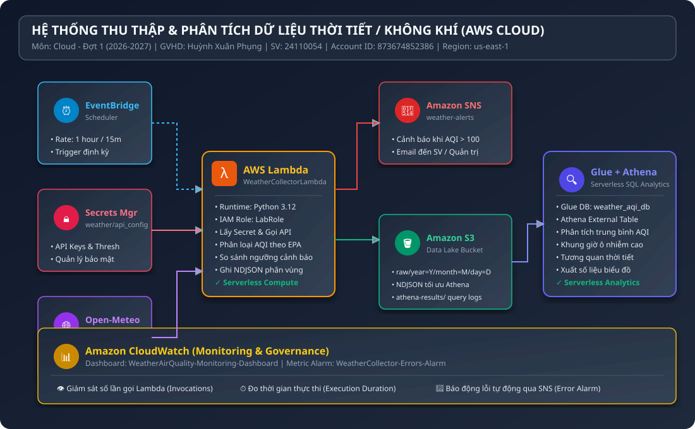

# KIẾN TRÚC HỆ THỐNG THU THẬP VÀ PHÂN TÍCH DỮ LIỆU THỜI TIẾT / KHÔNG KHÍ (AWS CLOUD)

> **Môn học:** Điện toán đám mây (Cloud Computing) - Đợt 1 (2026-2027)  
> **Giảng viên hướng dẫn (GVHD):** ThS. Huỳnh Xuân Phụng  
> **Sinh viên thực hiện:** 24110054 (Trường ĐH Sư Phạm Kỹ Thuật TP.HCM - HCMUTE)  
> **AWS Account ID:** `873674852386` | **Region:** `us-east-1` (N. Virginia)  
> **IAM Role sử dụng:** `arn:aws:iam::873674852386:role/LabRole`  

---

## 1. TỔNG QUAN HỆ THỐNG & MỤC TIÊU ĐỀ TÀI

Ô nhiễm không khí, đặc biệt là nồng độ bụi mịn PM2.5, PM10 và các khí độc hại (CO, NO2, SO2, O3) đang là thách thức nghiêm trọng tại các đô thị lớn ở Việt Nam (TP. Hồ Chí Minh, Hà Nội, Đà Nẵng). Đề tài xây dựng một đường ống dữ liệu (Data Pipeline) hoàn chỉnh trên nền tảng **Amazon Web Services (AWS)** theo mô hình **Serverless Event-Driven Architecture** nhằm:
1. **Thu thập định kỳ** dữ liệu thời tiết và chất lượng không khí từ Open-Meteo API theo lịch trình tự động.
2. **Lưu trữ bảo mật & tối ưu chi phí** trên Data Lake Amazon S3 dưới định dạng Newline Delimited JSON (NDJSON) được phân vùng theo thời gian (`year=YYYY/month=MM/day=DD`).
3. **Phân tích dữ liệu lớn không máy chủ** với AWS Glue Catalog và Amazon Athena, thực hiện các truy vấn SQL phân tích xu hướng ô nhiễm, khung giờ cao điểm và tương quan thời tiết.
4. **Cảnh báo tức thời** qua Amazon SNS khi nồng độ bụi mịn PM2.5 hoặc chỉ số US AQI vượt ngưỡng nguy hại cho sức khỏe.
5. **Giám sát tập trung** qua Amazon CloudWatch Metrics, Alarms và Dashboard.

---

## 2. SƠ ĐỒ KIẾN TRÚC HỆ THỐNG (SYSTEM ARCHITECTURE DIAGRAM)



### 2.1. Luồng dữ liệu (Data Flow Pipeline)
```
[ Open-Meteo APIs ]
        │ (HTTPS GET)
        ▼
[ AWS Secrets Manager ] ──(API Config & Key)──► [ AWS Lambda: WeatherCollectorLambda ] ◄──(Rate 1h)── [ EventBridge Scheduler ]
                                                            │
                            ┌───────────────────────────────┴──────────────────────────────┐
                            ▼                                                              ▼
               [ Amazon SNS Alert Topic ]                                      [ Amazon S3 Data Lake ]
              (High AQI Alert -> Email)                                      (s3://weather-aqi-.../raw/)
                                                                                           │
                                                                                           ▼
                                                                               [ AWS Glue Data Catalog ]
                                                                               (weather_aqi_db Database)
                                                                                           │
                                                                                           ▼
                                                                               [ Amazon Athena Engine ]
                                                                               (Serverless SQL Queries)
                                                                                           │
                                                                                           ▼
                                                                           [ Analytics & Visualizations ]
                                                                           (Pandas & Matplotlib Charts)
                                                                                           │
                                                                                           ▼
                                                                               [ Amazon CloudWatch ]
                                                                           (Metrics, Alarms & Dashboard)
```

---

## 3. THÀNH PHẦN CHI TIẾT & CẤU HÌNH TÀI NGUYÊN AWS

### 3.1. AWS Secrets Manager (`weather/api_config`)
- **Mục đích:** Lưu trữ bí mật các tham số kết nối API, API Key, tọa độ các đô thị giám sát và các ngưỡng cảnh báo AQI/PM2.5 theo tiêu chuẩn EPA/WHO.
- **Tính năng:** Tuân thủ quy định GVHD ("API key bên ngoài lưu Secrets Manager; tần suất gọi tuân thủ điều khoản API").
- **Dữ liệu JSON lưu trữ:**
  ```json
  {
    "api_provider": "open-meteo",
    "api_key": "sec_demo_weather_api_key_873674852386",
    "aqi_threshold_pm25": 35.5,
    "aqi_threshold_pm10": 50.0,
    "aqi_threshold_us_aqi": 100,
    "locations": [
      {"city": "HoChiMinh", "lat": 10.8231, "lon": 106.6297},
      {"city": "HaNoi", "lat": 21.0285, "lon": 105.8542},
      {"city": "DaNang", "lat": 16.0544, "lon": 108.2022}
    ]
  }
  ```

### 3.2. Amazon EventBridge Scheduler (`WeatherCollectionSchedule`)
- **Mục đích:** Kích hoạt Lambda định kỳ mà không cần duy trì bất kỳ máy chủ Cron nào.
- **Tần suất kích hoạt:** `rate(1 hour)` (linh hoạt điều chỉnh sang `rate(15 minutes)` khi cần giám sát liên tục).
- **Target:** ARN của hàm `WeatherCollectorLambda`.

### 3.3. AWS Lambda (`WeatherCollectorLambda`)
- **Runtime:** `Python 3.12` | **Architecture:** `x86_64` | **Memory:** `256 MB` | **Timeout:** `60s`.
- **IAM Execution Role:** `arn:aws:iam::873674852386:role/LabRole` (sử dụng LabRole có sẵn theo quy định AWS Academy Learner Lab).
- **Cơ chế hoạt động:**
  1. Đọc bí mật từ Secrets Manager.
  2. Gọi đồng thời Open-Meteo Air Quality API và Weather Forecast API cho TP.HCM, Hà Nội, Đà Nẵng.
  3. Chuẩn hóa dữ liệu sang cấu trúc bản ghi phân tích: `record_id`, `city`, `temperature_2m`, `relative_humidity_2m`, `pm2_5`, `pm10`, `us_aqi`, `aqi_category`, v.v.
  4. Đánh giá ngưỡng ô nhiễm: Nếu `us_aqi > 100` hoặc `pm2_5 > 35.5 µg/m³`, tự động định dạng thông điệp cảnh báo y tế và bắn sang Amazon SNS.
  5. Đóng gói bản ghi dạng **NDJSON** và ghi xuống Amazon S3 theo cấu trúc phân vùng thời gian.

### 3.4. Amazon S3 Data Lake (`weather-aqi-873674852386`)
- **Cấu trúc thư mục phân vùng:**
  ```
  s3://weather-aqi-873674852386/
  ├── raw/
  │   ├── year=2026/
  │   │   ├── month=10/
  │   │   │   ├── day=04/
  │   │   │   │   └── data_20261004_*.json
  │   │   │   ├── day=05/
  │   │   │   │   └── data_20261005_*.json
  │   │   │   └── day=06/
  │   │   │       └── data_20261006_*.json
  └── athena-results/
      ├── *.csv
      └── *.csv.metadata
  ```
- **Lợi ích kiến trúc phân vùng Hive-style (`key=val`):**
  - Athena chỉ quét (Scan) đúng thư mục ngày/tháng được chỉ định trong mệnh đề `WHERE year = '2026' AND month = '10'`, giảm đến 90-99% dung lượng quét và chi phí truy vấn.
  - Định dạng NDJSON cho phép Athena xử lý song song (parallel split) mà không cần nén toàn bộ tệp vào bộ nhớ.

### 3.5. AWS Glue Data Catalog & Amazon Athena
- **Database:** `weather_aqi_db`
- **External Table:** `weather_airquality_records`
- **SerDe:** `org.openx.data.jsonserde.JsonSerDe`
- **Khả năng phân tích:**
  - Tổng hợp chỉ số ô nhiễm min/max/avg theo từng đô thị.
  - Xác định chu kỳ biến thiên ô nhiễm theo 24 khung giờ trong ngày (Diurnal trend).
  - Phân tích tương quan Pearson giữa các yếu tố khí tượng (Nhiệt độ, Độ ẩm, Tốc độ gió) và nồng độ bụi mịn PM2.5.

### 3.6. Amazon SNS (`weather-airquality-alerts`)
- **Topic Type:** Standard.
- **Protocol:** Email (`24110054@student.hcmute.edu.vn`).
- **Nội dung cảnh báo:** Báo động mức độ ô nhiễm, giá trị PM2.5/AQI đo được, thời gian, vị trí và kèm theo khuyến cáo y tế phòng hộ cá nhân.

### 3.7. Amazon CloudWatch Monitoring & Governance
- **Metric Alarm:** `WeatherCollector-Errors-Alarm` giám sát lỗi phát sinh của Lambda và bắn cảnh báo qua SNS nếu số lỗi >= 1 trong chu kỳ 5 phút.
- **Dashboard:** `WeatherAirQuality-Monitoring-Dashboard` hiển thị biểu đồ trực quan số lượng lời gọi (Invocations), tỷ lệ lỗi (Errors) và độ trễ thực thi (Duration ms).

---

## 4. CHIẾN LƯỢC BẢO MẬT & QUẢN TRỊ (SECURITY & GOVERNANCE)

1. **Tuân thủ quy định Learner Lab:**
   - Tuyệt đối không tạo IAM User hay IAM Role mới (vốn bị khóa quyền trong Learner Lab).
   - Tận dụng `LabRole` có sẵn với đầy đủ quyền cho Lambda, S3, Glue, Athena, EventBridge, CloudWatch, SNS, Secrets Manager.
2. **Quản lý khóa & thông tin nhạy cảm:**
   - Không hardcode API key, chuỗi kết nối trong mã nguồn Git.
   - Toàn bộ secret được mã hóa lưu trữ trên AWS Secrets Manager.
3. **Gắn Tag tài nguyên bắt buộc:**
   - Tất cả tài nguyên triển khai (S3, Secrets Manager, SNS, Lambda, EventBridge, CloudWatch) đều được gắn nhãn định danh:
     - `Project`: `WeatherAWS_FinalTerm`
     - `Owner`: `24110054`
     - `Course`: `Cloud_FinalTerm`

---

## 5. PHÂN TÍCH VÀ TỐI ƯU CHI PHÍ (COST OPTIMIZATION)

| Dịch vụ AWS | Hạn ngạch miễn phí / Giá ước tính | Mức độ tiêu thụ của đồ án | Chi phí ước tính (USD/tháng) |
|---|---|---|---|
| **AWS Lambda** | 1,000,000 requests/tháng miễn phí | ~720 invocations/tháng (1h/lần) | $0.00 |
| **Amazon EventBridge** | 14,000,000 sự kiện/tháng miễn phí | 720 scheduled events/tháng | $0.00 |
| **Amazon S3** | 5 GB Standard Storage miễn phí | ~20 MB dữ liệu JSON phân vùng | < $0.001 |
| **Amazon Athena** | $5.00 cho mỗi 1 TB dữ liệu quét | Quét ~84 KB mỗi câu query | < $0.0001 |
| **AWS Glue Catalog** | 1,000,000 objects miễn phí | 1 Database, 1 Table, 3 Partitions | $0.00 |
| **AWS Secrets Manager** | $0.40/secret/tháng + $0.05/10k API calls | 1 Secret, ~720 calls | ~$0.40 |
| **Amazon SNS** | 1,000 email notifications/tháng miễn phí | ~50-100 emails cảnh báo | $0.00 |
| **Amazon CloudWatch** | 10 custom metrics, 3 dashboards miễn phí | 1 Dashboard, 1 Alarm | $0.00 |
| **TỔNG CHI PHÍ** | Nằm hoàn toàn trong hạn mức $100 Learner Lab | | **~$0.40 / tháng** |
