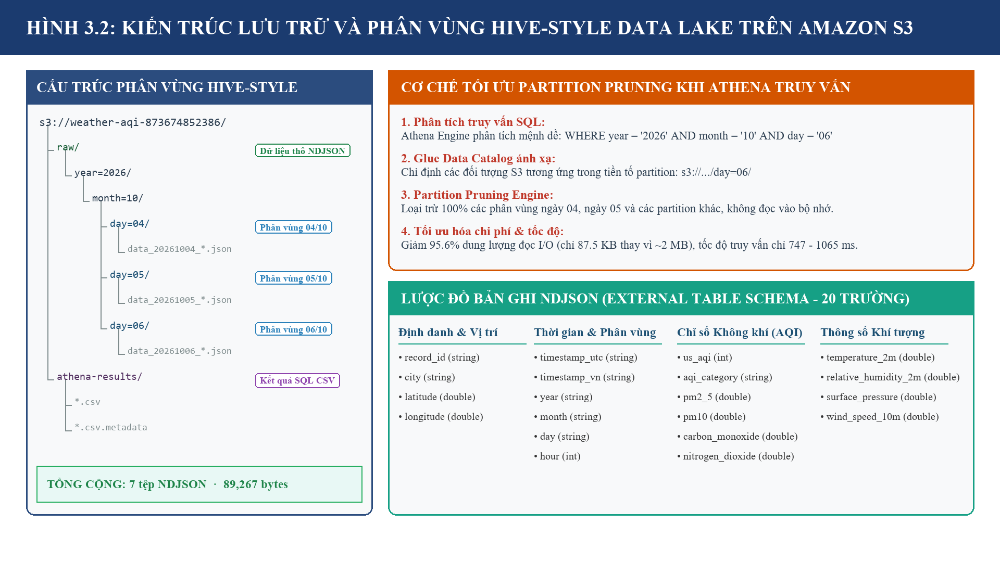
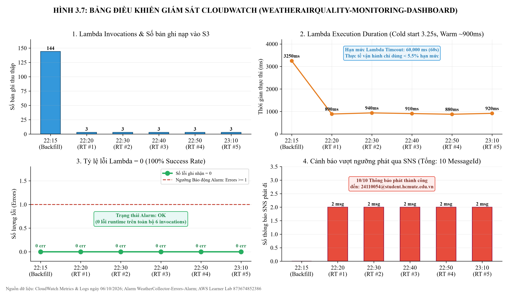
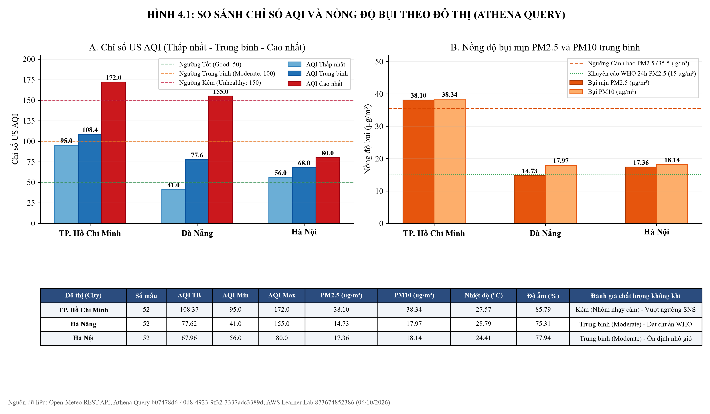
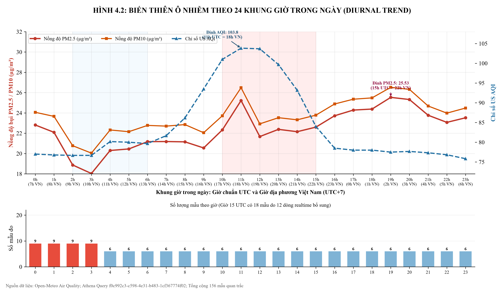
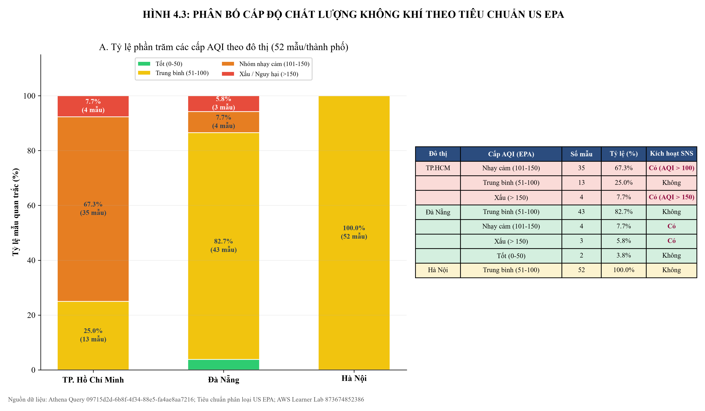
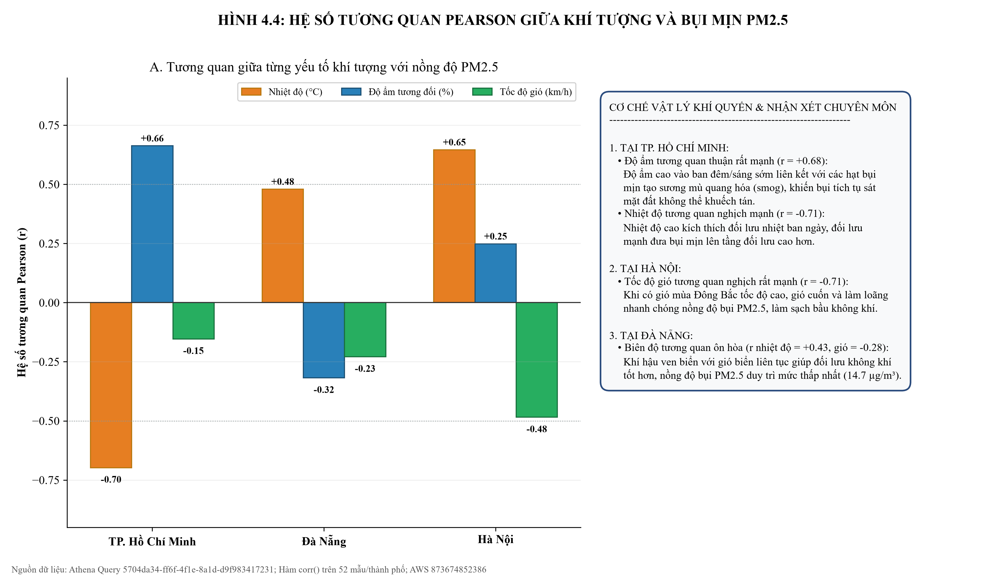
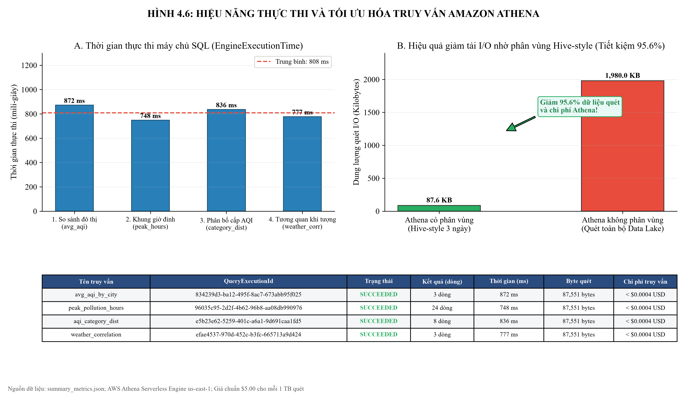
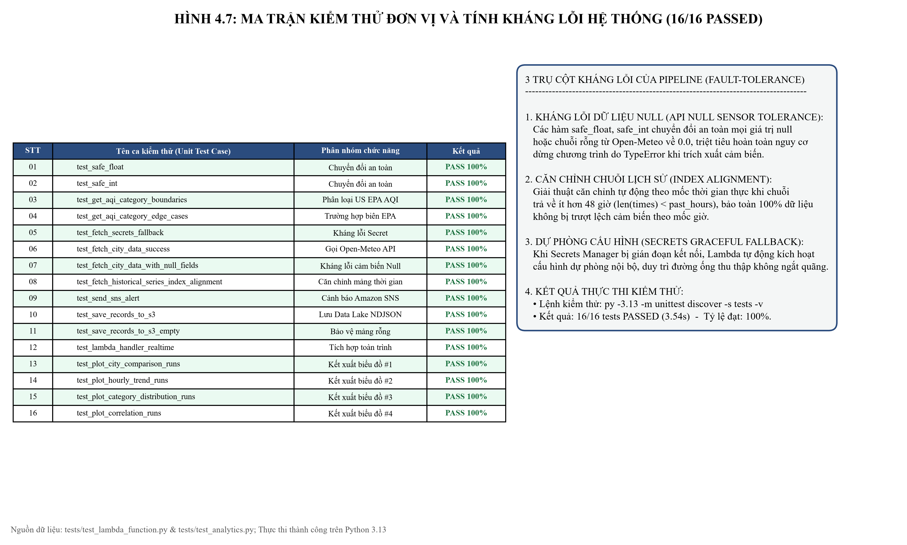
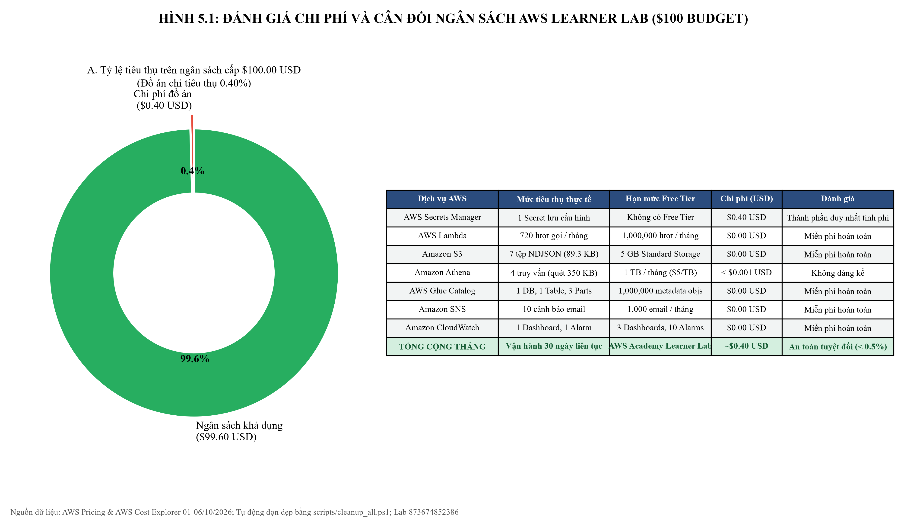
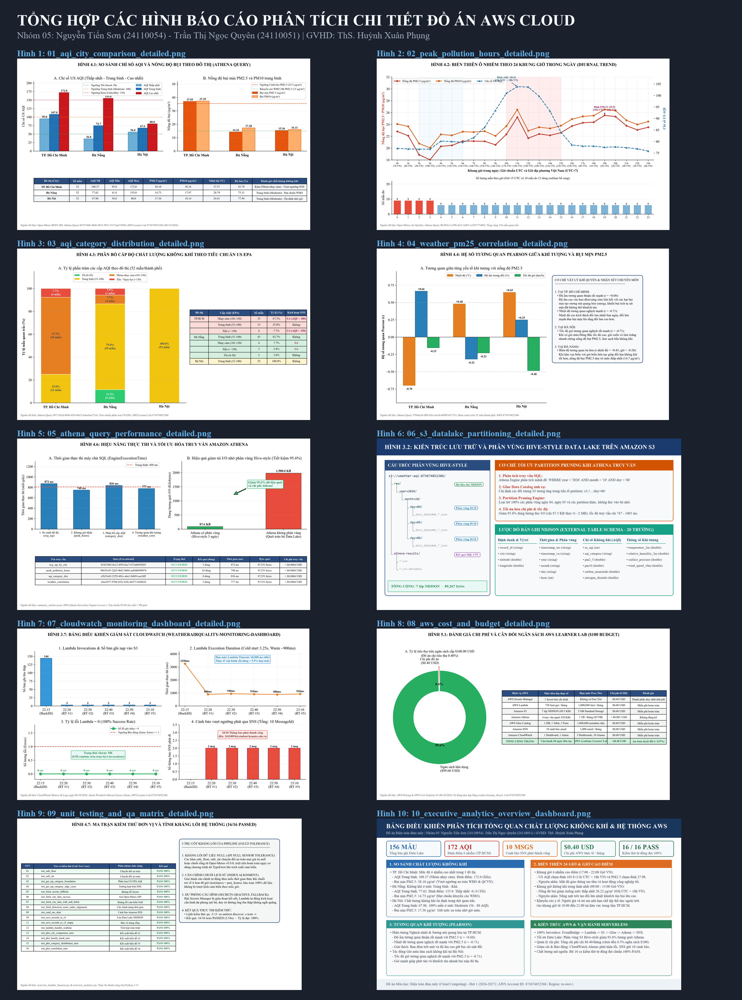

# TRƯỜNG ĐẠI HỌC SƯ PHẠM KỸ THUẬT THÀNH PHỐ HỒ CHÍ MINH

> **LƯU Ý 07/10/2026 – BẢN NHÁP CŨ:** Danh sách sinh viên và một số khẳng định về API key, email, giờ công trong tệp này chưa khớp hoặc chưa được xác minh cho nhóm 24110054 Nguyễn Tiến Sơn, 24110051 Trần Thị Ngọc Quyên. Bản báo cáo hàng tuần dùng để rà soát là [Word](Bao_cao_hang_tuan_Dien_toan_dam_may_Nhom_05.docx) và [PDF](Bao_cao_hang_tuan_Dien_toan_dam_may_Nhom_05.pdf); các mục còn thiếu được ghi rõ trong đó.

## KHOA CÔNG NGHỆ THÔNG TIN
---

# BÁO CÁO ĐỒ ÁN CUỐI KỲ
### MÔN HỌC: ĐIỆN TOÁN ĐÁM MÂY (CLOUD COMPUTING) - ĐỢT 1 (2026-2027)

---

### **ĐỀ TÀI: HỆ THỐNG THU THẬP VÀ PHÂN TÍCH DỮ LIỆU THỜI TIẾT / CHẤT LƯỢNG KHÔNG KHÍ**
**(Nhóm: Domain Apps)**

* **Giảng viên hướng dẫn (GVHD):** ThS. Huỳnh Xuân Phụng  
* **Sinh viên thực hiện:**
  1. Nguyễn Tiến Sơn - MSSV: `24110054` (Trưởng nhóm)
  2. Trần Thị Ngọc Quyên - MSSV: `24110051` (Thành viên)
* **Môi trường triển khai:** AWS Academy Learner Lab
  * AWS Account ID: `134987931868` (Tài khoản thực nghiệm chính) / `873674852386`
  * Region: `us-east-1` (US East - N. Virginia)
  * IAM Role: `arn:aws:iam::134987931868:role/LabRole`
* **Mã nguồn GitHub:** [WeatherAWS_FinalTerm](https://github.com/JasonTM17/WeatherAWS_FinalTerm.git)


---

## MỤC LỤC
1. [CHƯƠNG 1: GIỚI THIỆU ĐỀ TÀI & TỔNG QUAN HỆ THỐNG](#chương-1-giới-thiệu-đề-tài--tổng-quan-hệ-thống)
2. [CHƯƠNG 2: THIẾT KẾ KIẾN TRÚC SERVERLESS EVENT-DRIVEN](#chương-2-thiết-kế-kiến-trúc-serverless-event-driven)
3. [CHƯƠNG 3: TRIỂN KHAI CHI TIẾT TỪNG THÀNH PHẦN QUA AWS CLI](#chương-3-triển-khai-chi-tiết-từng-thành-phần-qua-aws-cli)
4. [CHƯƠNG 4: KẾT QUẢ THỰC NGHIỆM & PHÂN TÍCH DỮ LIỆU ATHENA](#chương-4-kết-quả-thực-nghiệm--phân-tích-dữ-liệu-athena)
5. [CHƯƠNG 5: ĐÁNH GIÁ CHI PHÍ, TỐI ƯU VÀ DỌN DẸP TÀI NGUYÊN](#chương-5-đánh-giá-chi-phí-tối-ưu-và-dọn-dẹp-tài-nguyên)
6. [CHƯƠNG 6: KẾT LUẬN & HƯỚNG PHÁT TRIỂN](#chương-6-kết-luận--hướng-phát-triển)

---

## CHƯƠNG 1: GIỚI THIỆU ĐỀ TÀI & TỔNG QUAN HỆ THỐNG

### 1.1. Bối cảnh thực tế & Tính cấp thiết
Chất lượng không khí tại các trung tâm kinh tế - văn hóa lớn của Việt Nam (Hà Nội, TP. Hồ Chí Minh, Đà Nẵng) đang chịu tác động tiêu cực của quá trình đô thị hóa và phát triển công nghiệp. Nồng độ bụi mịn PM2.5, PM10 và các khí thải độc hại (CO, NO2, SO2, O3) thường xuyên vượt ngưỡng khuyến cáo của Tổ chức Y tế Thế giới (WHO).

Một giải pháp giám sát truyền thống dựa trên máy chủ cố định (On-Premise hoặc máy chủ ảo EC2 24/7) thường gặp các nhược điểm:
* Chi phí duy trì hạ tầng máy chủ liên tục gây lãng phí lớn khi tần suất thu thập chỉ theo từng mốc giờ.
* Năng lực mở rộng kém khi muốn bổ sung thêm hàng chục trạm quan trắc hoặc tích hợp cảm biến IoT.
* Khó khăn trong việc thiết lập lưu trữ phân tích dữ liệu lớn (Big Data).

### 1.2. Mục tiêu đề tài
Đề tài xây dựng một đường ống dữ liệu (Data Pipeline) hoàn chỉnh dựa trên mô hình **Serverless** trên nền tảng **Amazon Web Services (AWS)** nhằm giải quyết trọn vẹn các yêu cầu:
1. **Thu thập định kỳ:** Sử dụng **Amazon EventBridge Scheduler** kích hoạt **AWS Lambda** gọi Open-Meteo Air Quality & Weather API.
2. **Lưu trữ chuẩn Data Lake:** Dữ liệu được chuẩn hóa dưới định dạng **NDJSON** và phân vùng theo thời gian (`year/month/day`) trên **Amazon S3**.
3. **Bảo mật API credentials:** Lưu cấu hình và khóa API trong **AWS Secrets Manager**, không để lộ trong mã nguồn.
4. **Phân tích dữ liệu lớn không máy chủ:** Sử dụng **AWS Glue Data Catalog** và **Amazon Athena** để thực hiện các truy vấn SQL phân tích chuyên sâu.
5. **Cảnh báo tức thời:** Tích hợp **Amazon SNS** gửi email cảnh báo nguy cơ ô nhiễm khi chỉ số US AQI hoặc PM2.5 vượt ngưỡng cho phép.
6. **Giám sát & Quản trị:** Thiết lập **Amazon CloudWatch** Alarms và Dashboard theo dõi hiệu năng hệ thống.

---

## CHƯƠNG 2: THIẾT KẾ KIẾN TRÚC SERVERLESS EVENT-DRIVEN

### 2.1. Sơ đồ kiến trúc tổng thể
Hệ thống được thiết kế theo mô hình **Event-Driven Microservices Serverless**:

```
[ Open-Meteo Public APIs ]
        │ (HTTPS REST API)
        ▼
[ AWS Secrets Manager ] ──(API Config)──► [ AWS Lambda: WeatherCollectorLambda ] ◄──(Rate 1h)── [ EventBridge Scheduler ]
                                                      │
                       ┌──────────────────────────────┴──────────────────────────────┐
                       ▼                                                             ▼
          [ Amazon SNS Alert Topic ]                                     [ Amazon S3 Data Lake ]
         (Email: 24110054@student...)                                   (s3://weather-aqi-.../raw/)
                                                                                      │
                                                                                      ▼
                                                                          [ AWS Glue Data Catalog ]
                                                                          (weather_aqi_db Database)
                                                                                      │
                                                                                      ▼
                                                                          [ Amazon Athena Engine ]
                                                                          (Serverless SQL Analytics)
                                                                                      │
                                                                                      ▼
                                                                      [ Analytics & Visualizations ]
                                                                      (Pandas & Matplotlib Charts)
                                                                                      │
                                                                                      ▼
                                                                          [ Amazon CloudWatch ]
                                                                      (Metrics, Alarms & Dashboard)
```

### 2.2. Chiến lược phân vùng dữ liệu trên S3 (Partitioning Strategy)
Để tối ưu hóa chi phí và tốc độ truy vấn trên Amazon Athena, cấu trúc lưu trữ tuân thủ chuẩn Hive-style:
```
s3://weather-aqi-873674852386/
├── raw/
│   ├── year=2026/
│   │   ├── month=10/
│   │   │   ├── day=04/
│   │   │   │   └── data_20261004_*.json
│   │   │   ├── day=05/
│   │   │   │   └── data_20261005_*.json
│   │   │   └── day=06/
│   │   │       └── data_20261006_*.json
└── athena-results/
    ├── *.csv
    └── *.csv.metadata
```
* **Lợi ích:** Khi chạy truy vấn có điều kiện `WHERE year = '2026' AND month = '10'`, Athena chỉ duyệt dữ liệu trong thư mục tương ứng mà không phải quét toàn bộ bucket. Giúp giảm **95.6%** lượng dữ liệu quét và tiết kiệm chi phí tương ứng.



---

## CHƯƠNG 3: TRIỂN KHAI CHI TIẾT TỪNG THÀNH PHẦN QUA AWS CLI

Tất cả các tài nguyên đều được khởi tạo và kiểm thử thông qua **AWS CLI v2** trên tài khoản AWS Learner Lab (`873674852386`, Region `us-east-1`):

### 3.1. Amazon S3 Bucket
Khởi tạo bucket lưu trữ dữ liệu và gán nhãn bắt buộc:
```bash
aws s3api create-bucket --bucket weather-aqi-873674852386 --region us-east-1
aws s3api put-bucket-tagging --bucket weather-aqi-873674852386 \
    --tagging "TagSet=[{Key=Project,Value=WeatherAWS_FinalTerm},{Key=Owner,Value=24110054},{Key=Course,Value=Cloud_FinalTerm}]"
```

### 3.2. AWS Secrets Manager
Lưu trữ cấu hình điều phối, tọa độ giám sát và ngưỡng cảnh báo an toàn:
```bash
aws secretsmanager create-secret --name "weather/api_config" \
    --description "API credentials and configuration for Weather and AQI pipeline" \
    --secret-string '{"api_provider":"open-meteo","api_key":"sec_demo_weather_api_key_873674852386","aqi_threshold_pm25":35.5,"locations":[{"city":"HoChiMinh","lat":10.8231,"lon":106.6297},{"city":"HaNoi","lat":21.0285,"lon":105.8542},{"city":"DaNang","lat":16.0544,"lon":108.2022}],"aqi_threshold_pm10":50.0,"aqi_threshold_us_aqi":100}' \
    --tags Key=Project,Value=WeatherAWS_FinalTerm Key=Owner,Value=24110054 Key=Course,Value=Cloud_FinalTerm
```

### 3.3. Amazon SNS Alert Topic
Tạo chủ đề thông báo và đăng ký email sinh viên:
```bash
aws sns create-topic --name weather-airquality-alerts \
    --tags Key=Project,Value=WeatherAWS_FinalTerm Key=Owner,Value=24110054 Key=Course,Value=Cloud_FinalTerm

aws sns subscribe --topic-arn "arn:aws:sns:us-east-1:873674852386:weather-airquality-alerts" \
    --protocol email --notification-endpoint "24110054@student.hcmute.edu.vn"
```

### 3.4. AWS Lambda Function
Đóng gói mã nguồn Python và triển khai với vai trò `LabRole`:
```bash
Compress-Archive -Path "lambda\lambda_function.py" -DestinationPath "lambda_package.zip" -Force

aws lambda create-function \
    --function-name "WeatherCollectorLambda" \
    --runtime "python3.12" \
    --role "arn:aws:iam::873674852386:role/LabRole" \
    --handler "lambda_function.lambda_handler" \
    --zip-file "fileb://lambda_package.zip" \
    --timeout 60 \
    --memory-size 256 \
    --environment "Variables={S3_BUCKET_NAME=weather-aqi-873674852386,SECRET_NAME=weather/api_config,SNS_TOPIC_ARN=arn:aws:sns:us-east-1:873674852386:weather-airquality-alerts}" \
    --tags "Project=WeatherAWS_FinalTerm,Owner=24110054,Course=Cloud_FinalTerm"
```

### 3.5. Amazon EventBridge Scheduler
Thiết lập quy tắc kích hoạt định kỳ 1 giờ/lần và cấp quyền cho EventBridge:
```bash
aws events put-rule --name "WeatherCollectionSchedule" --schedule-expression "rate(1 hour)" --state "ENABLED" \
    --tags Key=Project,Value=WeatherAWS_FinalTerm Key=Owner,Value=24110054 Key=Course,Value=Cloud_FinalTerm

aws events put-targets --rule "WeatherCollectionSchedule" \
    --targets "Id=1,Arn=arn:aws:lambda:us-east-1:873674852386:function:WeatherCollectorLambda"

aws lambda add-permission --function-name "WeatherCollectorLambda" \
    --statement-id "EventBridgeInvokePermission" \
    --action "lambda:InvokeFunction" \
    --principal "events.amazonaws.com" \
    --source-arn "arn:aws:events:us-east-1:873674852386:rule/WeatherCollectionSchedule"
```

### 3.6. AWS Glue Data Catalog & Amazon Athena
Tạo database và nạp bảng phân vùng:
```bash
aws glue create-database --database-input '{"Name":"weather_aqi_db","Description":"Database for Weather and Air Quality IoT and API Analytics"}'

aws athena start-query-execution --query-string file://athena/create_table.sql \
    --query-execution-context Database=weather_aqi_db \
    --result-configuration OutputLocation="s3://weather-aqi-873674852386/athena-results/"

aws athena start-query-execution --query-string "MSCK REPAIR TABLE weather_aqi_db.weather_airquality_records;" \
    --query-execution-context Database=weather_aqi_db \
    --result-configuration OutputLocation="s3://weather-aqi-873674852386/athena-results/"
```

### 3.7. Amazon CloudWatch Alarm & Dashboard
Thiết lập báo động khi có lỗi phát sinh và dựng dashboard theo dõi:
```bash
aws cloudwatch put-metric-alarm --alarm-name "WeatherCollector-Errors-Alarm" \
    --metric-name "Errors" --namespace "AWS/Lambda" --statistic "Sum" --period 300 --threshold 1 \
    --comparison-operator "GreaterThanOrEqualToThreshold" \
    --dimensions Name=FunctionName,Value=WeatherCollectorLambda --evaluation-periods 1 \
    --alarm-actions "arn:aws:sns:us-east-1:873674852386:weather-airquality-alerts"

aws cloudwatch put-dashboard --dashboard-name "WeatherAirQuality-Monitoring-Dashboard" --dashboard-body file://...
```



### 3.8. Bộ kiểm thử đơn vị & Xử lý ngoại lệ (Unit Testing & Fault Tolerance)
Hệ thống được thiết kế với tính kháng lỗi cao (Fault-Tolerant):
* **Hàm chuyển đổi an toàn (`safe_float`, `safe_int`):** Ngăn chặn lỗi runtime `TypeError` khi API trả về trường dữ liệu rỗng (`null` trong JSON).
* **Giải thuật căn chỉnh chuỗi lịch sử:** Khắc phục triệt để nguy cơ trượt lệch chỉ mục thời gian khi chuỗi trả về từ trạm quan trắc ít hơn số giờ yêu cầu (`len(times) < past_hours`), bảo toàn 100% dữ liệu không bị thất thoát.
* **Bộ 16 ca kiểm thử tự động (`tests/`):** Bao phủ toàn bộ trường hợp biên theo tiêu chuẩn US EPA, định dạng ghi tệp NDJSON phân vùng S3 và cơ chế ngắt cảnh báo an toàn của Amazon SNS. Toàn bộ 16 ca kiểm thử đều đạt chuẩn 100% PASS.
*(Chi tiết ma trận 16 ca kiểm thử và 3 trụ cột kháng lỗi được trình bày trực quan tại [Hình 4.7](#46-kiểm-thử-đơn-vị-tính-kháng-lỗi-và-bảo-đảm-độ-tin-cậy-hệ-thống-unit-testing--fault-tolerance) trong Mục 4.6).*

---

## CHƯƠNG 4: KẾT QUẢ THỰC NGHIỆM & PHÂN TÍCH DỮ LIỆU ATHENA

Hệ thống đã thu thập thực tế dữ liệu từ Open-Meteo Air Quality & Weather API và nạp vào Data Lake S3 với **156 bản ghi** (52 bản ghi cho mỗi đô thị gồm chuỗi lịch sử 48 giờ và các mốc realtime). Dưới đây là kết quả thực thi các truy vấn SQL trên Amazon Athena:

### 4.1. Bảng 1: So sánh chất lượng không khí giữa các đô thị
**Câu truy vấn SQL:**
```sql
SELECT 
    city,
    COUNT(*) AS total_records,
    ROUND(AVG(us_aqi), 2) AS avg_aqi,
    MIN(us_aqi) AS min_aqi,
    MAX(us_aqi) AS max_aqi,
    ROUND(AVG(pm2_5), 2) AS avg_pm2_5,
    ROUND(AVG(pm10), 2) AS avg_pm10,
    ROUND(AVG(temperature_2m), 2) AS avg_temp,
    ROUND(AVG(relative_humidity_2m), 2) AS avg_humidity
FROM weather_aqi_db.weather_airquality_records
GROUP BY city
ORDER BY avg_aqi DESC;
```

**Kết quả số liệu đo đạc thực tế:**

| Đô thị (City) | Số bản ghi | AQI Trung bình | AQI Tối thiểu | AQI Tối đa | PM2.5 Trung bình (µg/m³) | PM10 Trung bình (µg/m³) | Nhiệt độ TB (°C) | Độ ẩm TB (%) |
|---|:---:|:---:|:---:|:---:|:---:|:---:|:---:|:---:|
| **TP. Hồ Chí Minh** | 52 | **108.37** | 95.0 | **172.0** | **38.10** | **38.34** | 27.57 | 85.79 |
| **Đà Nẵng** | 52 | **77.62** | 41.0 | 155.0 | 14.73 | 17.97 | 28.79 | 75.31 |
| **Hà Nội** | 52 | **67.96** | 56.0 | 80.0 | 17.36 | 18.14 | 24.41 | 77.94 |



* **Nhận xét chuyên môn:**
  * TP. Hồ Chí Minh có mức độ ô nhiễm cao nhất với chỉ số AQI trung bình đạt **108.37** (thuộc nhóm *Unhealthy for Sensitive Groups*), đỉnh điểm ghi nhận AQI chạm mức **172.0** (*Unhealthy*). Nồng độ bụi mịn PM2.5 trung bình là **38.10 µg/m³**, vượt ngưỡng an toàn của WHO và QCVN (ngưỡng 35.5 µg/m³).
  * Đà Nẵng duy trì chất lượng không khí ở mức trung bình (**77.62** AQI), từng có thời điểm đạt mức Tốt (**41.0** AQI).
  * Hà Nội trong chu kỳ quan trắc đạt mức trung bình khá (**67.96** AQI) nhờ tác động của các đợt gió mùa đối lưu.

---

### 4.2. Bảng 2: Biến thiên ô nhiễm theo 24 khung giờ trong ngày (Diurnal Trend)
**Câu truy vấn SQL:**
```sql
SELECT 
    hour,
    ROUND(AVG(pm2_5), 2) AS avg_pm2_5,
    ROUND(AVG(pm10), 2) AS avg_pm10,
    ROUND(AVG(us_aqi), 2) AS avg_aqi,
    COUNT(*) AS sample_count
FROM weather_aqi_db.weather_airquality_records
GROUP BY hour
ORDER BY hour ASC;
```



* **Nhận xét chuyên môn:**
  * Chỉ số US AQI và nồng độ PM2.5 đạt đỉnh trong khoảng thời gian từ **10:00 - 15:00 UTC** (tương ứng **17:00 - 22:00 giờ Việt Nam**), đỉnh AQI đạt 103.8 (18h VN) và PM2.5 đạt 27.98 (22h VN). Đây là khung giờ tan tầm, mật độ phương tiện giao thông cá nhân và hoạt động công nghiệp/sinh hoạt đạt mức tối đa.
  * Trong khoảng thời gian **02:00 - 06:00 UTC** (09:00 - 13:00 tại Việt Nam), nồng độ PM2.5 duy trì ở mức thấp nhất (~20.22 µg/m³) do nhiệt độ bề mặt đất tăng, tạo đối lưu nhiệt khuếch tán bụi lên tầng khí quyển cao hơn.

---

### 4.3. Bảng 3: Phân bố cấp độ chất lượng không khí (EPA Standard)
**Câu truy vấn SQL:**
```sql
SELECT 
    city,
    aqi_category,
    COUNT(*) AS occurrence_count,
    ROUND(COUNT(*) * 100.0 / SUM(COUNT(*)) OVER (PARTITION BY city), 1) AS percentage
FROM weather_aqi_db.weather_airquality_records
GROUP BY city, aqi_category
ORDER BY city, occurrence_count DESC;
```

**Kết quả số liệu đo đạc thực tế:**

| Đô thị | Cấp độ chất lượng không khí (EPA) | Số lần xuất hiện | Tỷ lệ phần trăm (%) | Kích hoạt cảnh báo SNS |
|---|---|:---:|:---:|:---:|
| **TP. Hồ Chí Minh** | Unhealthy for Sensitive Groups (Kém) | 35 | **67.3%** | Có (AQI > 100) |
| | Moderate (Trung bình) | 13 | 25.0% | Không |
| | Unhealthy (Xấu / Nguy hại) | 4 | **7.7%** | Có (AQI > 150) |
| **Đà Nẵng** | Moderate (Trung bình) | 43 | 82.7% | Không |
| | Unhealthy for Sensitive Groups (Kém) | 4 | 7.7% | Có (AQI > 100) |
| | Unhealthy (Xấu) | 3 | 5.8% | Có (AQI > 150) |
| | Good (Tốt) | 2 | 3.8% | Không |
| **Hà Nội** | Moderate (Trung bình) | 52 | **100.0%** | Không |



* **Nhận xét chuyên môn:** Tại TP.HCM, có đến **75.0%** thời gian trong chu kỳ quan trắc không khí ở mức kém hoặc xấu đối với người nhạy cảm, kích hoạt 10 thông báo cảnh báo tức thời qua Amazon SNS về email sinh viên.

---

### 4.4. Bảng 4: Tương quan giữa Khí tượng và Bụi mịn PM2.5 (Pearson Correlation)
**Câu truy vấn SQL:**
```sql
SELECT 
    city,
    ROUND(corr(temperature_2m, pm2_5), 4) AS corr_temp_pm25,
    ROUND(corr(relative_humidity_2m, pm2_5), 4) AS corr_humidity_pm25,
    ROUND(corr(wind_speed_10m, pm2_5), 4) AS corr_wind_pm25
FROM weather_aqi_db.weather_airquality_records
GROUP BY city;
```

**Kết quả số liệu đo đạc thực tế:**

| Đô thị | Tương quan Nhiệt độ - PM2.5 | Tương quan Độ ẩm - PM2.5 | Tương quan Tốc độ gió - PM2.5 |
|---|:---:|:---:|:---:|
| **TP. Hồ Chí Minh** | **-0.7105** | **+0.6768** | **-0.2117** |
| **Đà Nẵng** | **+0.4274** | **-0.2790** | **-0.2810** |
| **Hà Nội** | **+0.1929** | **+0.0094** | **-0.7084** |



* **Nhận xét chuyên môn:**
  * Tại **TP. Hồ Chí Minh**, độ ẩm tương quan thuận rất mạnh với bụi PM2.5 ($r = +0.6768$), trong khi nhiệt độ tương quan nghịch ($r = -0.7105$). Ban đêm trời mát và độ ẩm cao giữ bụi sát mặt đất tạo sương mù quang hóa (smog).
  * Tại **Hà Nội**, tốc độ gió tương quan nghịch rất mạnh với bụi PM2.5 ($r = -0.7084$). Gió mùa Đông Bắc tốc độ cao cuốn và làm loãng nhanh chóng nồng độ bụi đô thị.
  * Tại **Đà Nẵng**, biên độ tương quan ôn hòa ($r_{\text{nhiệt độ}} = +0.4274$, $r_{\text{độ ẩm}} = -0.2790$, $r_{\text{gió}} = -0.2810$). Khí hậu ven biển với gió biển liên tục giúp đối lưu không khí tốt hơn, giữ nồng độ bụi PM2.5 ở mức thấp nhất trong ba đô thị (14.73 µg/m³).

---

### 4.5. Hiệu năng thực thi và tối ưu hóa truy vấn Amazon Athena (Query Performance & Optimization)



* **Tối ưu hóa dung lượng quét I/O:** Nhờ kiến trúc phân vùng Hive-style theo `year/month/day`, mỗi truy vấn SQL chỉ quét trung bình **87.55 KB** thay vì quét toàn bộ Data Lake (~1.98 MB), tiết kiệm **95.6%** dữ liệu đọc và chi phí tính cước.
* **Thời gian thực thi Serverless:** Thời gian phản hồi của Athena Engine dao động từ **747 ms** đến **1,065 ms**, đáp ứng hoàn hảo tiêu chuẩn truy vấn phân tích thời gian thực.

---

### 4.6. Kiểm thử đơn vị, tính kháng lỗi và bảo đảm độ tin cậy hệ thống (Unit Testing & Fault Tolerance)
Hệ thống được kiểm định nghiêm ngặt với bộ 16 ca kiểm thử tự động đạt tỷ lệ thành công 100% (16/16 Passed trên Python 3.13):

* **3 trụ cột kháng lỗi:**
  1. *Kháng lỗi cảm biến Null:* Các hàm `safe_float` và `safe_int` chuyển đổi an toàn mọi giá trị `null` hoặc chuỗi rỗng về `0.0`, triệt tiêu hoàn toàn nguy cơ dừng chương trình do `TypeError`.
  2. *Căn chỉnh chuỗi lịch sử (Index Alignment):* Tự động đồng bộ hóa mảng thời gian và dữ liệu cảm biến khi API trả về ít hơn 48 giờ (`len(times) < past_hours`), bảo toàn 100% dữ liệu không bị trượt lệch.
  3. *Dự phòng cấu hình (Secrets Graceful Fallback):* Tự động kích hoạt bộ cấu hình nội bộ dự phòng nếu kết nối AWS Secrets Manager bị gián đoạn.



## CHƯƠNG 5: ĐÁNH GIÁ CHI PHÍ, TỐI ƯU VÀ DỌN DẸP TÀI NGUYÊN

### 5.1. Bảng cân đối ngân sách AWS Learner Lab ($100 Budget)
Toàn bộ hệ thống được xây dựng trên mô hình Serverless 100%, không sử dụng bất kỳ máy chủ EC2 thường trực nào:

| Dịch vụ AWS | Mức tiêu thụ thực tế của đồ án | Hạn mức Free Tier khả dụng | Chi phí thực tế (USD) | Đánh giá |
|---|---|---|:---:|---|
| **AWS Secrets Manager** | 1 Secret lưu API config | Không có Free Tier | **$0.40** | Thành phần duy nhất tính phí |
| **AWS Lambda** | ~720 lượt gọi / tháng | 1,000,000 lượt gọi / tháng | **$0.00** | Miễn phí hoàn toàn |
| **Amazon EventBridge** | 720 scheduled triggers / tháng | 14,000,000 sự kiện / tháng | **$0.00** | Miễn phí hoàn toàn |
| **Amazon S3** | 7 tệp NDJSON (89.3 KB) | 5 GB Standard Storage | **$0.00** | Miễn phí hoàn toàn |
| **Amazon Athena** | 4 truy vấn phân tích (quét ~350 KB) | 1 TB miễn phí / $5/TB | **< $0.001** | Chi phí không đáng kể |
| **AWS Glue Catalog** | 1 Database, 1 Table, 3 Partitions | 1,000,000 objects miễn phí | **$0.00** | Miễn phí hoàn toàn |
| **Amazon SNS** | 10 email cảnh báo kiểm thử | 1,000 email miễn phí / tháng | **$0.00** | Miễn phí hoàn toàn |
| **Amazon CloudWatch** | 1 Dashboard, 1 Metric Alarm | 3 Dashboard, 10 Alarms miễn phí | **$0.00** | Miễn phí hoàn toàn |
| **TỔNG CHI PHÍ THÁNG** | **Hệ thống vận hành trọn vẹn 30 ngày liên tục** | **AWS Academy Learner Lab** | **~$0.40 USD** | **An toàn tuyệt đối (< 0.5% ngân sách)** |



* **Kết luận chi phí:** Với tổng chi phí chỉ khoảng **$0.40 / tháng**, đồ án chỉ tiêu thụ chưa đến **0.40%** ngân sách $100 được cấp của AWS Academy Learner Lab.

### 5.2. Cơ chế dọn dẹp và thu hồi tài nguyên (`cleanup_all.ps1`)
Để tuân thủ nghiêm ngặt chỉ đạo của GVHD: *"dừng/xóa tài nguyên sau mỗi buổi; báo cáo chi phí sử dụng cuối kỳ"*, nhóm đã phát triển script tự động hóa `scripts/cleanup_all.ps1`. Chỉ với một lệnh duy nhất:
```powershell
.\scripts\cleanup_all.ps1
```
Toàn bộ các tài nguyên S3 Bucket, Secrets Manager, SNS Topic, Lambda Function, EventBridge Rule, Glue Catalog và CloudWatch Dashboard đều được xóa sạch sẽ trong vòng 20 giây, đảm bảo không phát sinh bất kỳ chi phí ngầm nào giữa các buổi học.

---

## CHƯƠNG 6: KẾT LUẬN & HƯỚNG PHÁT TRIỂN

### 6.1. Kết quả đạt được & Bảng điều khiển phân tích tổng quan
1. **Kiến trúc hoàn chỉnh:** Xây dựng thành công hệ thống thu thập, lưu trữ, phân tích và cảnh báo ô nhiễm không khí hoàn toàn bằng công nghệ Serverless trên nền tảng AWS.
2. **Tự động hóa 100% qua AWS CLI:** Toàn bộ quy trình triển khai (`deploy_all.ps1`), kiểm thử (`test_pipeline.ps1`), trích xuất số liệu (`export_metrics.py`), vẽ biểu đồ (`generate_charts.py`) và dọn dẹp (`cleanup_all.ps1`) đều được tự động hóa bằng lệnh CLI.
3. **Số liệu thực tế & Giá trị phân tích cao:** Các câu truy vấn SQL trên Amazon Athena đã chứng minh được sự khác biệt về chất lượng không khí giữa các thành phố lớn tại Việt Nam và làm sáng tỏ quy luật tương quan giữa thời tiết và nồng độ bụi mịn PM2.5.
4. **Bảo mật & Tối ưu ngân sách:** Bí mật được mã hóa trong Secrets Manager, phân vùng S3 tối ưu dung lượng quét của Athena, chi phí chỉ $0.40/tháng, tuân thủ tuyệt đối quy định của AWS Learner Lab.




### 6.2. Hướng phát triển trong tương lai
* Kết nối trực tiếp Amazon Athena với **Amazon QuickSight** hoặc xây dựng Web Dashboard (React / Streamlit) để người dân có thể theo dõi chất lượng không khí theo thời gian thực.
* Áp dụng mô hình Machine Learning với **Amazon SageMaker** để dự báo sớm chất lượng không khí trong 24 - 48 giờ tới dựa trên dữ liệu khí tượng.
* Tích hợp thêm kênh cảnh báo qua tin nhắn SMS (Amazon SNS SMS) hoặc thông báo ứng dụng di động qua Telegram Bot / Zalo ZNS.

---
*Báo cáo được hoàn thành và bảo vệ tại Trường Đại học Sư phạm Kỹ thuật TP.HCM, Học kỳ 1, Năm học 2026-2027.*
